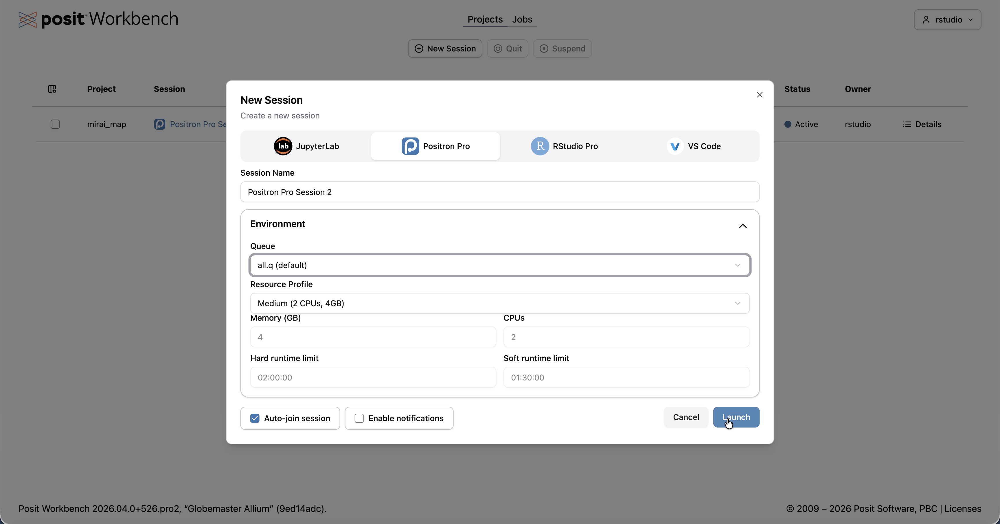
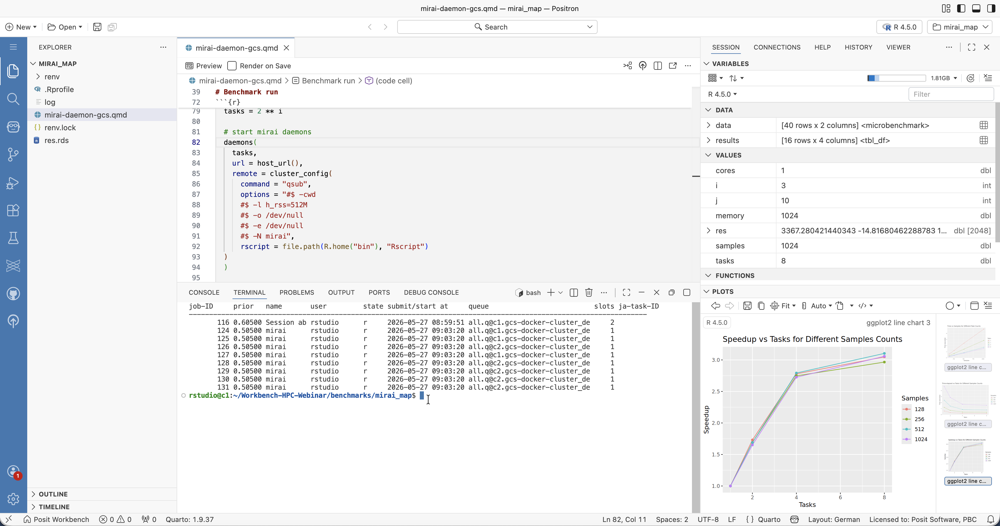

:::{.callout-warning}
This document is a draft and currently under review.
:::

::: {layout-ncol=2 style="max-width: 600px; margin: 1em auto; align-items: center;"}
{width=250 fig-alt="Posit logo"}

{width=250 fig-alt="HPC Gridware logo"}
:::

## Running Posit Workbench on Gridware Cluster Scheduler managed Clusters

We are excited to announce a new Launcher plugin that brings Posit Workbench to [Gridware Cluster Scheduler](https://hpc-gridware.com/gridware-cluster-scheduler/) managed clusters. This plugin is the result of a collaboration between Posit's Solution Engineering organisation and [HPC Gridware](https://hpc-gridware.com/), the company behind both the open-source Open Cluster Scheduler and the commercial Gridware Cluster Scheduler.

This plugin enables data science teams running Open Cluster Scheduler (formerly known as Sun Grid Engine) compatible environments --- including GCS, UGE, and SoGE --- to launch RStudio, Jupyter, VS Code, and Positron sessions directly onto their cluster, with full resource management handled by the scheduler.

::: {layout-ncol=2 style="max-width: 600px; margin: 1em auto; align-items: center;"}
[{width=45% fig-alt="Workbench session launcher"}](images/gcs01.png){target="_blank"}

[{width=45% fig-alt="Workbench session running"}](images/gcs03.png){target="_blank"}
:::

## What Does the Plugin Do?

Posit Workbench uses a component called the *Launcher* to submit and manage interactive sessions and batch jobs on external compute infrastructure. The Gridware Cluster Scheduler Launcher plugin bridges Workbench and Gridware Cluster Scheduler, allowing users to start sessions on the cluster without leaving the familiar Workbench interface.

Key capabilities include:

- **Job submission and lifecycle management** --- submit, monitor, suspend, resume, and terminate jobs on your Gridware Cluster Scheduler cluster, all from the Workbench UI.
- **Resource profiles** --- administrators can define named profiles (e.g., "Small", "Medium", "GPU") that map to specific CPU, memory, and GPU allocations, making it easy for users to pick the right resources without knowing scheduler syntax.
- **User and group resource limits** --- control who can access which resources. Profiles that exceed a user's limits are greyed out in the UI with a clear explanation.
- **GPU and parallel environment support** --- request GPUs and leverage parallel environments (SMP, MPI) for multi-core or distributed workloads.
- **Container support** --- run sessions inside Singularity/Apptainer containers for reproducible environments.
- **Automatic cluster resource detection** --- the plugin queries the cluster at startup to determine available resources, so slider limits in the UI reflect what your cluster actually offers.
- **Custom resource requirements** --- admins can add additional resource constraints.

## A Collaboration Between Posit and HPC Gridware

This plugin has been built by Posit's Solution Engineering team in collaboration with HPC Gridware. HPC Gridware offers two products:

- **Open Cluster Scheduler** --- an open-source workload scheduler for Linux clusters
- **Gridware Cluster Scheduler** --- a commercial, enterprise-grade scheduler with advanced features and support

The plugin works with both products as well as legacy SGE-compatible environments.

## Current Status and How to Get Involved

The Gridware Cluster Scheduler Launcher plugin is **ready for testing**. It is not currently part of the official Posit Workbench product distribution. This means it does not ship with Workbench and is not covered by Posit's standard support agreements at this time. Support for now is provided directly by the developers.

Depending on customer interest and feedback, there is a clear path toward integrating this plugin into the official product --- at which point it would receive full support from Posit's support organisation.

### Requirements

1. **A Posit Workbench Advanced license** --- this Launcher plugin requires an Advanced tier license.
2. **A Gridware Cluster Scheduler managed cluster** --- an existing cluster running one of HPC Gridware's two schedulers, or any other SGE-compatible scheduler.

For initial testing, a `docker-compose` environment is available to test this integration. More information is available upon request.

## Get in Touch

If you are running Gridware Cluster Scheduler or an SGE-compatible scheduler and want to evaluate this plugin, or if you have questions about HPC integration with Posit Workbench, please reach out:

- **Michael Mayer** --- Principal Solution Engineer, Posit --- [michael.mayer@posit.co](mailto:michael.mayer@posit.co)
- **Daniel Gruber** --- Founder and Chief Solutions Officer, HPC Gridware --- [dgruber@hpc-gridware.com](mailto:dgruber@hpc-gridware.com)

We look forward to hearing from you and learning how this plugin can serve your team's data science workflows on Gridware Cluster Scheduler infrastructure.
